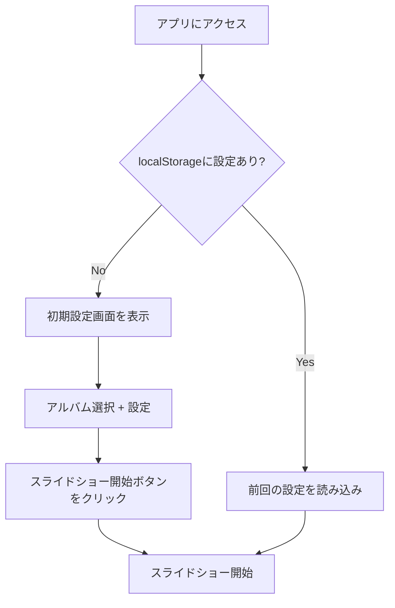
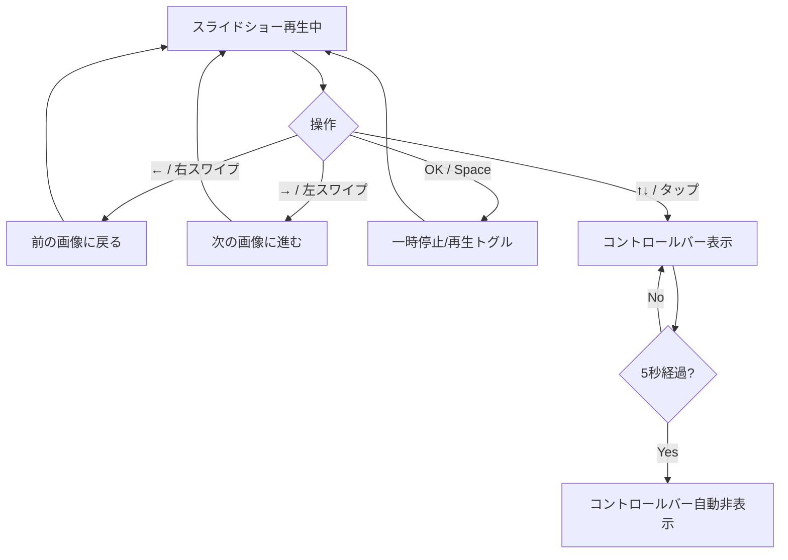
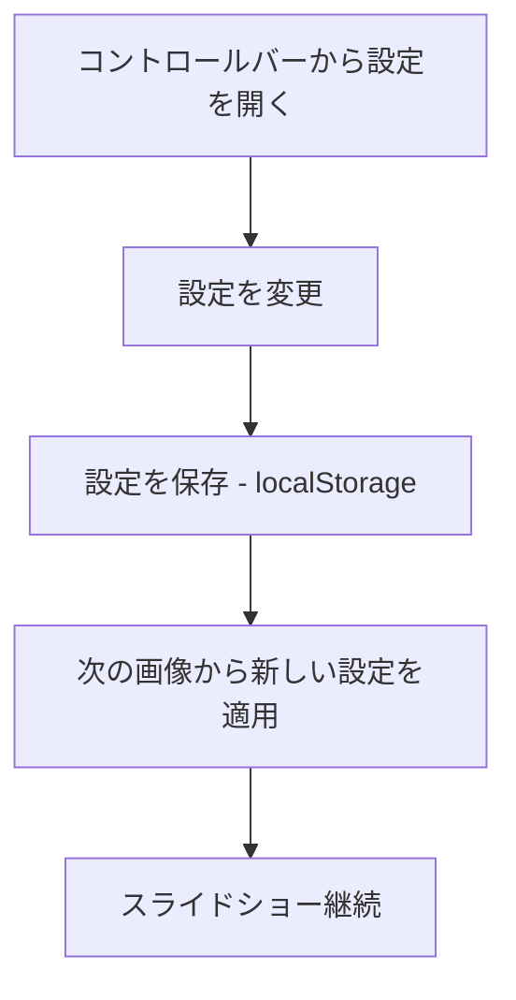
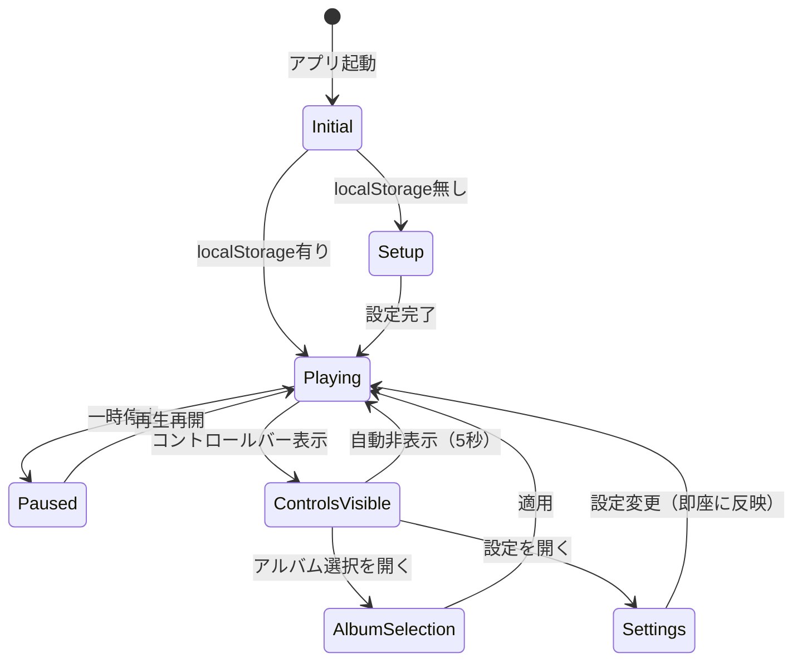
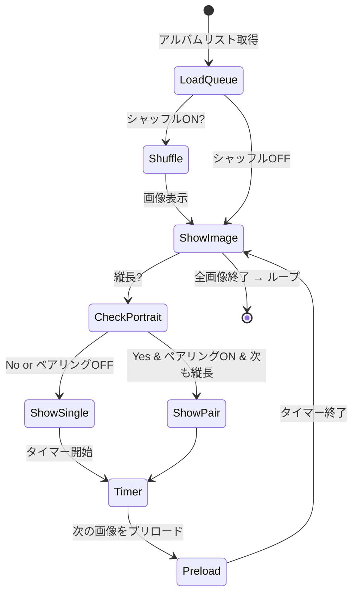

# UI設計書 — Webスライドショーアプリ

_作成日: 2025-10-14_
_バージョン: v1.0_

---

## 📋 目次

1. [概要](#概要)
2. [画面レイアウト](#画面レイアウト)
3. [UI要素の詳細仕様](#ui要素の詳細仕様)
4. [操作フロー](#操作フロー)
5. [状態遷移図](#状態遷移図)
6. [レスポンシブ対応](#レスポンシブ対応)
7. [アクセシビリティ](#アクセシビリティ)

---

## 概要

### デザインコンセプト
- **ミニマル・TV最適化**：画像が主役、UIは最小限
- **直感的操作**：リモコン・タッチ・マウスすべてに対応
- **高い可読性**：TV画面での視認性を重視

### ターゲットデバイス
1. **TCL Google TV**（メイン）- リモコン操作
2. **iPhone/iPad**（サブ）- タッチ操作
3. **PC/Mac**（サブ）- マウス・キーボード操作

---

## 画面レイアウト

### 🎬 通常再生画面（コントロールバー非表示）

```
┏━━━━━━━━━━━━━━━━━━━━━━━━━━━━━━━━━━━━━━━━━━━━━━┓
┃                                              ┃
┃                                              ┃
┃                                              ┃
┃          [画像表示エリア - 全画面]            ┃
┃                                              ┃
┃                                              ┃
┃                                              ┃
┃                              ┌─────────────┐ ┃
┃                              │ 10月14日 Tue │ ┃ ← オーバーレイ
┃                              │ ☀ 23°C 23:45│ ┃   （右下固定）
┃                              └─────────────┘ ┃
┗━━━━━━━━━━━━━━━━━━━━━━━━━━━━━━━━━━━━━━━━━━━━━━┛
```

### 🎛️ コントロールバー表示画面

```
┏━━━━━━━━━━━━━━━━━━━━━━━━━━━━━━━━━━━━━━━━━━━━━━┓
┃                                              ┃
┃          [画像表示エリア]                     ┃
┃                                              ┃
┃                              ┌─────────────┐ ┃
┃                              │ 10月14日 Tue │ ┃
┃                              │ ☀ 23°C 23:45│ ┃
┃                              └─────────────┘ ┃
┣━━━━━━━━━━━━━━━━━━━━━━━━━━━━━━━━━━━━━━━━━━━━━━┫
┃ コントロールバー（半透明背景 rgba(0,0,0,0.8)）  ┃
┃ ┌─────────────────────────────────────────┐ ┃
┃ │ [アルバム選択] [設定] [◀] [⏸/▶] [▶]    │ ┃
┃ └─────────────────────────────────────────┘ ┃
┗━━━━━━━━━━━━━━━━━━━━━━━━━━━━━━━━━━━━━━━━━━━━━━┛
```

### 🎨 初回アクセス時：設定画面

```
┏━━━━━━━━━━━━━━━━━━━━━━━━━━━━━━━━━━━━━━━━━━━━━━┓
┃                                              ┃
┃  ┌──────────────────────────────────────┐   ┃
┃  │   ようこそ — Webスライドショー          │   ┃
┃  ├──────────────────────────────────────┤   ┃
┃  │                                      │   ┃
┃  │  📁 アルバムを選択してください         │   ┃
┃  │                                      │   ┃
┃  │  ☑ Cats                             │   ┃
┃  │  ☑ Fantasy                          │   ┃
┃  │  ☐ Portraits                        │   ┃
┃  │  ☐ Nature                           │   ┃
┃  │                                      │   ┃
┃  │  ⚙ 表示時間: 60秒 [スライダー]        │   ┃
┃  │  🔀 シャッフル: ON                   │   ┃
┃  │                                      │   ┃
┃  │           [スライドショー開始] ▶       │   ┃
┃  │                                      │   ┃
┃  └──────────────────────────────────────┘   ┃
┃                                              ┃
┗━━━━━━━━━━━━━━━━━━━━━━━━━━━━━━━━━━━━━━━━━━━━━━┛
```

---

## UI要素の詳細仕様

### 1. オーバーレイ（右下固定・常時表示）

**配置：** 画面右下、余白 24px

**構成：**
```
┌───────────────┐
│ 10月14日 Tue  │  ← 1行目：日付・曜日（英語略称）
│ ☀ 23°C 23:45 │  ← 2行目：天気アイコン・気温・時刻
└───────────────┘
```

**スタイル：**
- **フォント：**
  - 日付・曜日: 18px, font-weight: 400
  - 天気・時刻: 20px, font-weight: 500
- **色：** `rgba(255, 255, 255, 0.7)` (白、不透明度70%)
- **背景：** `rgba(0, 0, 0, 0.5)` (黒、半透明)
- **パディング：** 12px
- **ボーダー半径：** 8px
- **影：** `text-shadow: 2px 2px 4px rgba(0, 0, 0, 0.8)`

**天気アイコン対応表：**
| 天気 | アイコン | OpenWeatherMap条件 |
|------|---------|-------------------|
| 晴れ | ☀ | Clear |
| 曇り | ☁ | Clouds |
| 雨 | 🌧 | Rain |
| 雪 | ❄️ | Snow |
| 霧 | 🌫 | Mist/Fog |

**表示条件：**
- 時計: `config.json` の `clock: true` の場合
- 天気: `config.json` の `weather: true` かつAPIキー設定済みの場合

---

### 2. コントロールバー（画面下部）

**表示トリガー：**
- **TV:** リモコンの ↑ or ↓ キー
- **スマホ/タブレット:** 画面タップ
- **PC:** マウス移動 or クリック

**自動非表示：** 最後の操作から **5秒後** に自動的にフェードアウト

**構成：**
```
┌────────────────────────────────────────────────┐
│ [アルバム] [設定] [◀] [⏸/▶] [▶]               │
└────────────────────────────────────────────────┘
```

**ボタン詳細：**

1. **[アルバム]** ボタン
   - クリック → アルバム選択モーダルを開く

2. **[設定] ⚙** ボタン
   - クリック → 設定パネルを開く（モーダルまたは展開パネル）

3. **[◀] 前へ** ボタン
   - 前の画像に戻る

4. **[⏸/▶] 再生/一時停止** ボタン
   - トグル動作

5. **[▶] 次へ** ボタン
   - 次の画像に進む

**スタイル：**
- **背景：** `rgba(0, 0, 0, 0.8)`
- **高さ：** 72px
- **ボタンサイズ：** 48x48px（TV用に大きめ）
- **アイコン色：** `rgba(255, 255, 255, 0.9)`
- **ホバー時：** `rgba(255, 255, 255, 1.0)` + scale(1.1)
- **フォーカス時（TV）：** 黄色のアウトライン `outline: 3px solid #FFD700`

---

### 3. アルバム選択モーダル

**表示条件：** コントロールバーの「アルバム」ボタンをクリック

**レイアウト：**
```
┌────────────────────────────────────┐
│  📁 アルバムを選択                  │
├────────────────────────────────────┤
│                                    │
│  ☑ Cats           (124枚)         │
│  ☑ Fantasy        (87枚)          │
│  ☐ Portraits      (45枚)          │
│  ☐ Nature         (203枚)         │
│                                    │
│  すべて選択  |  すべて解除          │
│                                    │
│         [キャンセル]  [適用] ✓      │
│                                    │
└────────────────────────────────────┘
```

**仕様：**
- **チェックボックス形式**
- 各アルバムの画像枚数を表示
- 「すべて選択」「すべて解除」ボタン
- 「適用」ボタンで設定を反映 → **即座に新しいアルバムリストで再生再開**

**スタイル：**
- **背景：** `rgba(20, 20, 20, 0.95)`
- **最大幅：** 600px（中央配置）
- **最大高さ：** 80vh（スクロール可能）
- **チェックボックス：** カスタムスタイル、大きめ（TV対応）

---

### 4. 設定パネル

**表示条件：** コントロールバーの「設定」ボタンをクリック

**レイアウト：**
```
┌────────────────────────────────────┐
│  ⚙ 設定                            │
├────────────────────────────────────┤
│                                    │
│  🕐 表示時間                        │
│     [3秒] ━━━●━━━━ [120秒]        │
│     現在: 60秒                      │
│                                    │
│  🔀 シャッフル再生                  │
│     [ON / OFF]  (トグルスイッチ)   │
│                                    │
│  🖼️ 縦長画像ペアリング              │
│     [ON / OFF]                     │
│                                    │
│  🕐 時計を表示                      │
│     [ON / OFF]                     │
│                                    │
│  🌤️ 天気を表示                     │
│     [ON / OFF]                     │
│                                    │
│         [閉じる]                   │
│                                    │
└────────────────────────────────────┘
```

**仕様：**
- **スライダー：** 表示時間（3〜120秒、デフォルト60秒）
- **トグルスイッチ：** ON/OFF切り替え
- **設定変更 → 即座に反映**（次の画像から適用）
- **localStorage自動保存**

---

### 5. 画像表示エリア

**通常モード（横長 or 単一画像）：**
```css
.image-container {
  width: 100vw;
  height: 100vh;
  display: flex;
  justify-content: center;
  align-items: center;
  background: #000;
}

.image-container img {
  max-width: 100%;
  max-height: 100%;
  object-fit: contain;
}
```

**縦長ペアリングモード（2枚並べ）：**
```
┌─────────────────────────┐
│          │              │
│  縦長画像1│  縦長画像2    │
│          │              │
└─────────────────────────┘
```

```css
.image-container.portrait-pair {
  display: flex;
  flex-direction: row;
  gap: 16px;
  padding: 0 24px;
}

.image-container.portrait-pair img {
  max-height: 100vh;
  max-width: 48%;
  object-fit: contain;
}
```

**縦長判定条件：**
- アスペクト比 ≤ 0.8 (高さ ÷ 幅)

**フェード遷移：**
```css
.image-fade-in {
  animation: fadeIn 1s ease-in-out;
}

@keyframes fadeIn {
  from { opacity: 0; }
  to { opacity: 1; }
}
```

---

## 操作フロー

### 🎮 デバイス別操作一覧

| 操作 | TV（リモコン） | スマホ/タブレット | PC |
|------|---------------|-----------------|-----|
| **前の画像** | ← キー | 左スワイプ | ← キー |
| **次の画像** | → キー | 右スワイプ | → キー |
| **一時停止/再生** | OK（決定）キー | — | Space キー |
| **コントロールバー表示** | ↑ or ↓ キー | 画面タップ | マウス移動 or クリック |
| **フルスクリーン** | — | ピンチアウト | F キー |

### 🔄 操作フロー詳細

#### 初回アクセス時


#### スライドショー再生中


#### 設定変更時


---

## 状態遷移図

### アプリ全体の状態



### 画像遷移ロジック



---

## レスポンシブ対応

### ブレークポイント

| デバイス | 幅 | 特別対応 |
|---------|-----|---------|
| **TV** | 1920x1080 | リモコン操作、大きめボタン |
| **タブレット** | 768px〜1024px | タッチ操作、スワイプ |
| **スマホ（横）** | 667px〜812px | タッチ操作 |
| **スマホ（縦）** | 〜667px | 縦長ペアリング無効 |

### 縦長画面（スマホ縦持ち）での調整
- 縦長ペアリング機能を自動的に無効化
- オーバーレイを下部中央に移動
- コントロールバーのボタンサイズを小さく調整

---

## アクセシビリティ

### キーボードナビゲーション
- **Tab**: フォーカス移動
- **Enter**: ボタン実行
- **Escape**: モーダル閉じる
- **← →**: 画像送り
- **Space**: 再生/一時停止

### 視覚的配慮
- **高コントラスト**: テキストと背景の明度差を確保
- **フォーカスインジケーター**: リモコン操作時に明確な黄色アウトライン
- **アニメーション削減**: `prefers-reduced-motion` 対応

### スクリーンリーダー対応
- 適切な `aria-label` を設定
- 画像には `alt` 属性（ファイル名ベース）
- モーダルには `role="dialog"` と `aria-modal="true"`

---

## 付録：カラーパレット

```css
:root {
  --bg-main: #000000;
  --overlay-bg: rgba(0, 0, 0, 0.5);
  --control-bg: rgba(0, 0, 0, 0.8);
  --text-primary: rgba(255, 255, 255, 0.9);
  --text-secondary: rgba(255, 255, 255, 0.7);
  --accent: #FFD700; /* フォーカス時 */
  --button-hover: rgba(255, 255, 255, 1.0);
}
```

---

## 変更履歴

| 日付 | バージョン | 変更内容 |
|------|-----------|---------|
| 2025-10-14 | v1.0 | 初版作成 |

